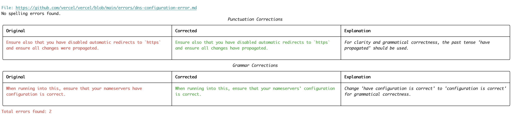

<p align="center">
  
</p>

<p align="center">
  <em>AI spelling and grammar checker for documentation</em>
</p>


<p align="center">
<a href="https://twitter.com/agentopsai/">🐦 Twitter</a>
<span>&nbsp;&nbsp;•&nbsp;&nbsp;</span>
<a href="https://discord.gg/a4VQ23Aps5">📢 Discord</a>
<span>&nbsp;&nbsp;•&nbsp;&nbsp;</span>
<a href="https://agentops.ai/?spellcaster">🖇️ AgentOps</a>
</p>

[](https://www.python.org/downloads/release/python-3100/)
[](https://opensource.org/licenses/MIT)

Spellcaster is an open-source CLI tool that uses AI to improve your codebase's documentation. It scans repositories for:

- Grammar errors
- Spelling mistakes
- Issues in code examples

Spellcaster helps identify potential problems to help you write clear, concise, and professional documentation.


https://github.com/user-attachments/assets/60dbfdb1-d5a6-4dfd-9707-37e60d60b24e


To run Spellcaster:
```bash
pip install spellcaster
spellcaster -d /path/to/your/docs/directory/
```




## 🦉 Features

* Grammar and Spelling Checks: Spellcaster reviews your documentation and comments to ensure they are clear, correct, and professional.
* Comprehensive File Scanning: Spellcaster reads across multiple file formats (Markdown, plain text, etc.) to detect issues.

## Installation

1. Install package:

   ```bash
   pip install spellcaster
   ```

2. Set up environment variables:

   Create a `.env` file in your project root and add the following variables:

   ```
   AGENTOPS_API_KEY=your_agentops_api_key
   ANTHROPIC_API_KEY=your_anthropic_api_key
   OPENAI_API_KEY=your_openai_api_key
   GROQ_API_KEY=your_groq_api_key
   ```

Spellcaster uses AgentOps for cost and latency tracking. You can sign up for an API key [here](https://app.agentops.ai/).

Replace `your_*_api_key` with your actual API keys for each service.

### Usage

To run Spellcaster:

1. In your terminal, use the following command structure:

   ```bash
   spellcaster [options]
   ```

   Options:
   - `-d`, `--directory`: The directory to scan
   - `-u`, `--url`: The GitHub repository URL to clone and scan
   - `-l`, `--llm_provider`: The LLM provider to use (choices: claude, sonnet, 3.5, gpt4o, gpt4, gpt3.5; default: MODEL from config)
   - `-p`, `--proper_nouns`: A string of proper nouns to include in the prompt (default: "* Llama3.1-70B\n* Cerebras\n* Cohere\n* OpenAI\n* AgentOps\n* Spellcaster")
   - `-f`, `--file_types`: File types to scan (default: from FILE_TYPES in config)
   - `-m`, `--max_files`: Maximum number of files to scan (default: MAX_FILES from config)

2. Examples:

   Scan a local directory with custom LLM provider:
   ```bash
   spellcaster --directory /path/to/your/docs --llm_provider gpt4
   ```
   
   Scan a GitHub repository:
   ```bash
   spellcaster --url https://github.com/username/repo
   ```

3. Spellcaster will analyze the specified directory or repository and output any detected issues, along with suggestions for fixing them.

### Configuration

You can customize Spellcaster's behavior by adjusting the `config.py` file:

- `FILE_TYPES`: A list of file extensions to scan. By default, it includes `.mdx` and `.md` files. You can add or remove file extensions as needed.
- `MAX_FILES`: The maximum number of files to scan. By default, it's set to 500. You can change this number to suit your needs.
- `MODEL`: The default LLM provider to use. Model list available [here](https://models.litellm.ai).
