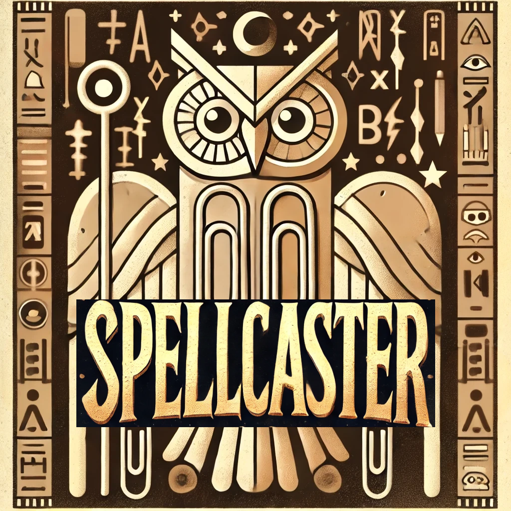

# Spellcaster

<p align="center">
  
</p>

_AI-powered documentation and code quality enhancement for your repositories._

[](https://www.python.org/downloads/release/python-3100/)
[](https://opensource.org/licenses/MIT)

Spellcaster is an open-source tool that leverages AI agents to enhance the quality of your codebase by scanning repositories for grammar, spelling, and code example errors in documentation files. It reads through your repository and identifies potential issues, helping you fix them with ease.

## Features

* Grammar and Spelling Checks: Spellcaster reviews your documentation and comments to ensure they are clear, correct, and professional.
* Comprehensive File Scanning: Spellcaster reads across multiple file formats (Markdown, plain text, etc.) to detect issues.

## Installation

1. Install package:

   ```bash
   pip install Spellcaster
   ```

### Usage

To run Spellcaster on a directory:

1. In your terminal, run the following command:

   ```bash
   Spellcaster --url <path-to-your-repo-on-github>
   ```

2. Spellcaster will analyze the directory and output any detected issues, along with suggestions for fixing them.

### Configuration

You can customize Spellcaster’s behavior by adjusting the `pyproject.toml` file:

- Set file types to scan (e.g., `.md`, `.txt`, `.py`).
- Define directories to include/exclude in the scan.
- Enable/disable automatic fixes.

## Contributing

We welcome contributions! If you’d like to help improve Spellcaster:

1. Fork the repository.
2. Create a new branch:
   ```bash
   git checkout -b feature-branch
   ```
3. Commit your changes:
   ```bash
   git commit -m "Add your feature"
   ```
4. Push to the branch:
   ```bash
   git push origin feature-branch
   ```
5. Open a pull request.

### Development

The four of us developeed Spellcaster at the DevTools Hackathon 2024 in SF.
<a href="https://github.com/areibman/spellcaster/graphs/contributors">
  
</a>

## License

This project is licensed under the MIT License - see the [LICENSE](LICENSE) file for details.

---

Feel free to adjust this according to your preferences!
